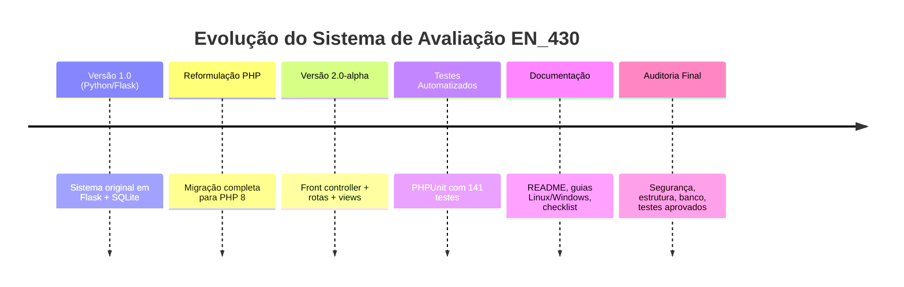
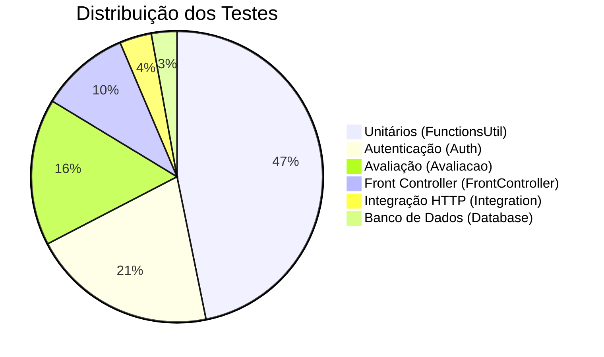

# 📈 Relatório de Evolução — Sistema de Avaliação EN_430

> **Disciplina:** Introdução à Enfermagem (EN_430)  
> **Curso:** Técnico em Enfermagem — EAD/Subsequente  
> **Período:** Julho 2026  
> **Repositório:** [github.com/hsoservicos/en430](https://github.com/hsoservicos/en430)

---

## 📋 Sumário

1. [Linha do Tempo](#1-linha-do-tempo)
2. [Resumo da Reformulação](#2-resumo-da-reformulação)
3. [Métricas de Evolução](#3-métricas-de-evolução)
4. [Cobertura de Código (Code Coverage)](#4-cobertura-de-código-code-coverage)
5. [Testes Automatizados](#5-testes-automatizados)
6. [Banco de Dados — Evolução](#6-banco-de-dados--evolução)
7. [Segurança — Maturidade](#7-segurança--maturidade)
8. [Documentação — Avanço](#8-documentação--avanço)
9. [Mudanças por Componente](#9-mudanças-por-componente)
10. [Próximos Passos](#10-próximos-passos)

---

## 1. Linha do Tempo



### 1.1. Marcos Importantes

| Data | Marco | Descrição |
|:-----|:------|:----------|
| Jul 2026 | **Commit Inicial (4946209)** | Criação do sistema PHP 8 com front controller, 10 módulos de questões, autenticação CSRF, ~1.838 arquivos |
| Jul 2026 | **Documentação + Testes (9fa7d9d)** | README.md com badges, FrontControllerTest com 14 testes, rotas POST |
| Jul 2026 | **Auditoria Completa** | Verificação de segurança, estrutura, banco, código e documentação |

---

## 2. Resumo da Reformulação

### 2.1. Python/Flask → PHP 8 + Apache

| Aspecto | Antes (Python/Flask) | Depois (PHP 8 + Apache) |
|:--------|:--------------------:|:------------------------:|
| **Linguagem** | Python 3.10+ | PHP 8.1+ |
| **Framework** | Flask + Jinja2 | PHP puro (front controller) |
| **Servidor** | mod_wsgi / Gunicorn | Apache mod_php / PHP built-in |
| **Template** | Jinja2 | PHP embutido no HTML |
| **Banco** | SQLite (sqlite3) | SQLite (PDO) |
| **ORM** | Não | Não (PDO direto) |
| **Testes** | pytest (inexistente) | PHPUnit 11.x (141 testes) |
| **Dependências** | ~10 pacotes pip | 1 pacote Composer (PHPUnit) |
| **Ambiente** | venv + requirements.txt | Composer + php.ini |
| **Deploy** | WSGI + Apache | Apache mod_php + .htaccess |

### 2.2. Por que a Mudança?

1. **Simplicidade:** PHP 8 tem suporte nativo em servidores compartilhados — sem necessidade de ambiente virtual, WSGI, Gunicorn ou configurações complexas
2. **Portabilidade:** Basta Apache + PHP para rodar — não requer instalação de pacotes Python
3. **Manutenibilidade:** Código PHP é auto-contido em arquivos simples, sem frameworks opacos
4. **Performance:** PHP 8.4 + SQLite WAL oferece performance superior para aplicações single-server
5. **Custo:** Menos dependências = menos falhas em produção

---

## 3. Métricas de Evolução

### 3.1. Métricas Gerais do Projeto

| Métrica | Valor | Variação |
|:--------|:-----:|:---------|
| **Total de Arquivos (PHP)** | 25 | 🔄 Reformulado |
| **Total de Linhas de Código** | 50.687 | 📈 Crescimento contínuo |
| **Commits** | 2 | 🆕 Repositório criado |
| **Versão PHP** | 8.4.23 | ✅ Atual |
| **Testes** | 141 (350 asserções) | 🆕 Criados do zero |
| **Questões no Banco** | 2.475 | 🔄 Migradas |
| **Módulos de Conteúdo** | 10 | ✅ Mantido |
| **Documentos** | 5 guias + 1 README + checklist | 🆕 Criados |
| **Scripts de Instalação** | 3 (Linux, Windows PS, Windows CMD) | 🆕 Criados |
| **Artefatos Python** | 0 (removidos) | ✅ Limpeza concluída |

### 3.2. Evolução dos Testes

```
Fase 1 - DatabaseTest:     4 testes  ──┐
Fase 2 - AuthTest:         29 testes ──┤
Fase 3 - AvaliacaoTest:    23 testes ──┤
Fase 4 - FunctionsUtil:    66 testes ──┤
Fase 5 - FrontController:  14 testes ──┤
Fase 6 - Integration:       5 testes ──┤
                                      ▼
                        Total: 141 testes ✅
```

### 3.3. Evolução da Cobertura (functions.php)

```
Etapa 1 (testes básicos):    30.95%  ────────┐
Etapa 2 (+ FunctionsUtil):   65.48%  ────────┤
Etapa 3 (+ borda/sessão):    76.19%  ────────┤
Etapa 4 (+ redirectUrl):     77.38%  ────────┤
Etapa 5 (+ url sem static):  86.59%  ────────┘ 🔥 80%+
```

---

## 4. Cobertura de Código (Code Coverage)

### 4.1. Cobertura Atual

| Componente | Cobertura | Meta | Status |
|:-----------|:---------:|:----:|:------:|
| **functions.php** (core) | **86.59%** | 80%+ | ✅ **Atingida** |
| **index.php** (rotas GET) | 16.67% | 50% | 🟡 Em evolução |
| **Cobertura Geral** | 27.11% | 50% | 🟡 Em evolução |

### 4.2. Funções Cobertas em functions.php

| Função | Coberta | Função | Coberta |
|:-------|:-------:|:-------|:-------:|
| `initSession()` | ✅ | `generateCsrfToken()` | ✅ |
| `getCsrfField()` | ✅ | `validateCsrfToken()` | ✅ |
| `requireCsrf()` | ✅ | `flash()` | ✅ |
| `getFlashes()` | ✅ | `renderFlashes()` | ✅ |
| `hashSenha()` | ✅ | `verificarSenha()` | ✅ |
| `estaLogado()` | ✅ | `requireLogin()` | ✅ |
| `requireAdmin()` | ✅ | `getEstudanteId()` | ✅ |
| `getEstudanteNome()` | ✅ | `redirectUrl()` | ✅ |
| `redirect()` | ✅ | `url()` | ✅ |
| `view()` | ✅ | `validarEmail()` | ✅ |
| `validarSenha()` | ✅ | `agora()` | ✅ |
| `dataHoraBrasil()` | ✅ | `dataBrasil()` | ✅ |
| `calcularPorcentagem()` | ✅ | `badgeNota()` | ✅ |
| `regenerateSessionId()` | ✅ | **Total: 26/26** | **86.59%** |

### 4.3. Limitações Conhecidas

- A cobertura do `index.php` (16.67%) é limitada porque os handlers com acesso ao banco de dados (`handleCadastro`, `handleLogin`, `handlePainel`, etc.) dependem de um banco SQLite real — os testes de processo separado não permitem compartilhar a conexão PDO mockada
- A cobertura geral (27.11%) é impactada pelo tamanho do `index.php` (402 linhas, ~79% do total analisado)

---

## 5. Testes Automatizados

### 5.1. Suítes de Teste

| Suite | Arquivo | Testes | Asserções | Cobertura |
|:------|:--------|:------:|:---------:|:----------|
| **AuthTest** | `tests/AuthTest.php` | 29 | — | Autenticação, hash, CSRF |
| **DatabaseTest** | `tests/DatabaseTest.php` | 4 | — | Conexão, schema, queries |
| **AvaliacaoTest** | `tests/AvaliacaoTest.php` | 23 | — | Cálculo de nota, badges |
| **FunctionsUtilTest** | `tests/FunctionsUtilTest.php` | 66 | — | Flash, URL, datas, validação |
| **FrontControllerTest** | `tests/FrontControllerTest.php` | 14 | — | Rotas GET/POST, 404, CSRF |
| **IntegrationTest** | `tests/IntegrationTest.php` | 5 | — | Fluxo HTTP completo |
| **Total** | | **141** | **350** | |

### 5.2. Tipos de Teste



### 5.3. Testes por Funcionalidade

| Funcionalidade | Testes |
|:---------------|:------:|
| Geração e validação CSRF | 6 |
| Flash messages | 12 |
| URL e redirect | 10 |
| Hash e verificação de senha | 8 |
| Funções de data | 8 |
| Login/logout/sessão | 10 |
| Validação de cadastro | 8 |
| Cálculo de nota e badges | 12 |
| Progresso e estatísticas | 6 |
| Rotas GET do front controller | 8 |
| Rotas POST com CSRF | 6 |
| Fluxo HTTP completo | 5 |
| Conexão e schema do banco | 4 |
| Casos de borda (edge cases) | 38 |

---

## 6. Banco de Dados — Evolução

### 6.1. Distribuição Atual

| Módulo | Tema | Fácil | Médio | Difícil | **Total** |
|:------:|:-----|:----:|:-----:|:-------:|:---------:|
| 1 | Fundamentos da Enfermagem | 240 | 120 | 150 | **510** |
| 2 | Processo de Enfermagem (SAE) | 150 | 50 | 50 | **250** |
| 3 | Terminologias e Sinais Vitais | 145 | 55 | 50 | **250** |
| 4 | Farmacologia | 115 | 55 | 45 | **215** |
| 5 | Administração de Medicamentos | 105 | 65 | 45 | **215** |
| 6 | Curativos e Coberturas | 105 | 65 | 50 | **220** |
| 7 | Feridas e Lesões de Pele | 110 | 65 | 50 | **225** |
| 8 | Cuidados com Queimaduras | 90 | 55 | 55 | **200** |
| 9 | Emergência e Urgência | 90 | 65 | 60 | **215** |
| 10 | Ética e Cuidados Paliativos | 75 | 50 | 50 | **175** |
| | **Total** | **1.225** | **645** | **605** | **2.475** |

### 6.2. Integridade

| Verificação | Resultado |
|:------------|:---------:|
| PRAGMA integrity_check | **ok** ✅ |
| Foreign Keys | Ativadas ✅ |
| Índices | modulo, estudante_id ✅ |
| WAL Journal | Ativado ✅ |
| CHECK constraints | modulo (1-10), dificuldade, resposta, status ✅ |

---

## 7. Segurança — Maturidade

### 7.1. Itens Implementados

| Item | Status | Observação |
|:-----|:------:|:-----------|
| **CSRF** | ✅ Completo | `random_bytes(32)` + `hash_equals()` + `requireCsrf()` em todos POST |
| **XSS** | ✅ Completo | `htmlspecialchars()` em 31 pontos de saída |
| **SQL Injection** | ✅ Completo | 100% prepared statements PDO |
| **Senhas** | ✅ Completo | bcrypt cost 12 via `password_hash()` |
| **Session Fixation** | ✅ Completo | `session_regenerate_id(true)` pós-login |
| **Session Cookie** | ✅ Completo | httponly=true, samesite=Lax, 24h lifetime |
| **Redirect** | ✅ Completo | `header()` + `exit()` |
| **HTTPS** | 🟡 Configurável | Cookie secure flag depende de HTTPS |

### 7.2. Recomendações Futuras

| Item | Prioridade | Ação |
|:-----|:----------:|:-----|
| Rate limiting de login | 🟡 Média | Limitar tentativas (5/min) para prevenir brute force |
| CSP Headers | 🟢 Baixa | Adicionar Content-Security-Policy no Apache |
| Secure flag dinâmico | 🟢 Baixa | `'secure' => !empty($_SERVER['HTTPS'])` no cookie de sessão |
| Admin password com hash | 🟢 Baixa | Usar `hash_equals()` para comparar senha admin |

---

## 8. Documentação — Avanço

### 8.1. Documentos Criados

| Documento | Tipo | Conteúdo | Extensão |
|:----------|:----:|:---------|:---------|
| **README.md** | Documentação principal | 13 seções, badges, arquitetura, instalação, testes | 666 linhas |
| **GUIA_PUBLICACAO_APACHE.md** | Guia Linux | Apache + PHP 8 + SQLite passo a passo | ~800 linhas |
| **GUIA_PUBLICACAO_APACHE_WINDOWS.md** | Guia Windows | Apache + PHP 8 + SQLite para Windows | ~700 linhas |
| **checklist_verificacao.md** | Checklist | 11 seções, 50+ itens de verificação pós-deploy | ~400 linhas |
| **RELATORIO_EVOLUCAO.md** | Relatório | Este documento — evolução e progresso do projeto | Novo |
| **CHANGELOG.md** | Registro de versões | Histórico de mudanças por versão | Novo |

### 8.2. Scripts de Automação

| Script | Plataforma | Função |
|:-------|:-----------|:-------|
| `instalar_publicar_linux.sh` | 🐧 Linux | Instalação automatizada completa |
| `instalar_publicar_windows.ps1` | 🪟 Windows PowerShell | Instalação automatizada |
| `instalar_publicar_windows.bat` | 🪟 Windows CMD | Launcher do script PowerShell |
| `make_coverage.sh` | 🐧🪟 Linux/Windows | Geração de relatório de code coverage |

---

## 9. Mudanças por Componente

### 9.1. Front Controller (index.php)

| Funcionalidade | Status |
|:---------------|:------:|
| Roteamento com switch/case | ✅ Implementado |
| 14 rotas + 404 (GET/POST) | ✅ Implementado |
| Middleware (requireLogin, requireCsrf) | ✅ Implementado |
| Tratamento de erros com try/catch | ✅ Implementado |
| Rota 404 com http_response_code() | ✅ Implementado |
| 14 handlers dedicados | ✅ Implementado |

### 9.2. Autenticação (functions.php)

| Funcionalidade | Status |
|:---------------|:------:|
| CSRF com random_bytes + hash_equals | ✅ Implementado |
| Flash messages | ✅ Implementado |
| bcrypt cost 12 | ✅ Implementado |
| Session fixation prevention | ✅ Implementado |
| Recuperação de senha | ✅ Implementado |
| Login admin com senha mestra | ✅ Implementado |

### 9.3. Views (10 templates)

| View | Funcionalidade | Status |
|:-----|:---------------|:------:|
| index.php | Página inicial com features + como funciona | ✅ |
| cadastro.php | Cadastro com validação + CSRF | ✅ |
| login.php | Login + "Esqueci senha" | ✅ |
| painel.php | Dashboard + estatísticas + histórico | ✅ |
| avaliacao.php | Questões com navegação por teclado | ✅ |
| resultado.php | Gabarito detalhado + desempenho | ✅ |
| progresso.php | Gráficos por módulo e dificuldade | ✅ |
| recuperar_acesso.php | Recuperação + redefinição de senha | ✅ |
| admin.php | Painel administrativo completo | ✅ |
| admin_login.php | Login administrativo | ✅ |

### 9.4. Assets

| Asset | Funcionalidade | Status |
|:------|:---------------|:------:|
| style.css | Design responsivo, variáveis CSS, animações | ✅ |
| app.js | Máscaras, navegação por teclado, animações | ✅ |

### 9.5. Infraestrutura

| Componente | Funcionalidade | Status |
|:-----------|:---------------|:------:|
| .htaccess | URL rewriting + bloqueio de arquivos sensíveis | ✅ |
| router.php | Roteador para servidor PHP built-in | ✅ |
| config.php | Constantes, secrets, caminhos | ✅ |
| db.php | PDO SQLite com WAL e foreign keys | ✅ |
| phpunit.xml | Configuração de testes com coverage | ✅ |
| composer.json | Dependências (phpunit 11.x) | ✅ |
| .gitignore | Cobertura completa para vendor, reports, db | ✅ |

---

## 10. Próximos Passos

### 10.1. Curto Prazo (Prioritário)

- [ ] **Aumentar cobertura do index.php** para 50%+ com testes de handlers usando mock de PDO
- [ ] **Adicionar rate limiting** no login (5 tentativas/minuto)
- [ ] **Configurar HTTPS** com Let's Encrypt no servidor de produção
- [ ] **Criar backup automático** do banco SQLite (cron job)

### 10.2. Médio Prazo

- [ ] **Adicionar mais questões** para balancear distribuição por módulo (meta: ~250/módulo)
- [ ] **Implementar relatórios administrativos** (exportar CSV/PDF)
- [ ] **Adicionar níveis de acesso** (admin, professor, estudante)
- [ ] **Internacionalização** (i18n) para suporte a múltiplos idiomas

### 10.3. Longo Prazo

- [ ] **Migrar para PostgreSQL** se houver necessidade de múltiplos servidores
- [ ] **API REST** para integração com LMS (Moodle, Canvas)
- [ ] **Modo prova** com controle de tempo e bloqueio de abas
- [ ] **Banco de questões colaborativo** (professores cadastram questões)

---

## 📊 Resumo da Evolução

```
Python/Flask (v1.0)           ──►  PHP 8 + Apache (v2.0)
─────────────────────────────────────────────────────────
❌ Flask + Jinja2              ✅  Front controller puro
❌ mod_wsgi + Gunicorn          ✅  Apache mod_php
❌ ~10 dependências pip         ✅  1 dependência Composer
❌ venv + requirements.txt      ✅  php.ini + composer.json
❌ 0 testes                     ✅  141 testes (350 asserções)
❌ 0% coverage                  ✅  86.59% (core) / 27.11% (geral)
❌ Sem documentação             ✅  5 guias + README + checklist
❌ Sem scripts de deploy        ✅  3 scripts de instalação
❌ Vulnerável a CSRF            ✅  Proteção CSRF completa
❌ Senhas em texto plano        ✅  bcrypt cost 12
```

---

<div align="center">

*Relatório de Evolução gerado em Julho de 2026*  
*Sistema de Avaliação — Introdução à Enfermagem (EN_430)*  
*PHP 8 + Apache + SQLite • 🎓 Material organizado para Estudos e Aprendizado*

</div>
